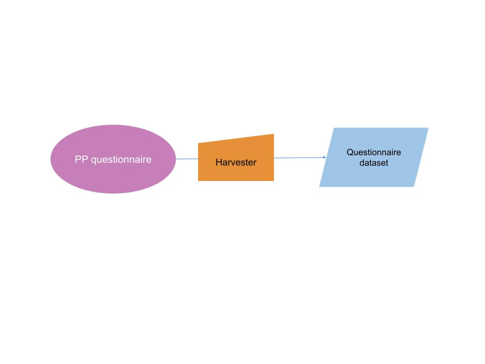
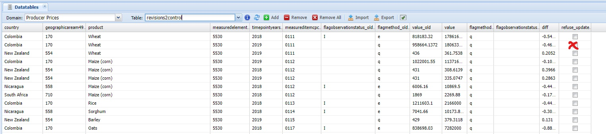
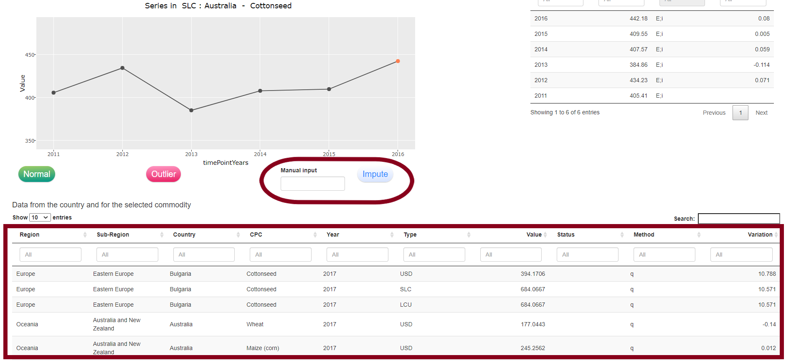
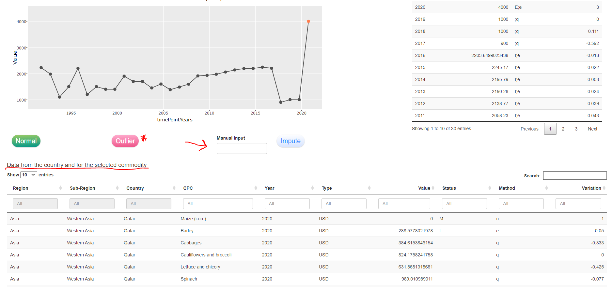

# **User Guide**

Before starting the workflow it is very important the user verify all the auxiliary information needed in each step are up-to-date. Specifically the user should verify:

- Exchange rates dataset (*Exchange Rates* in the Common domain) and related datatables (*currency_changes*, *currency_country_years*, *currency_dates*, *lcu_2_m49*) are up-to-date.

- The Trade Openness Index datatable contains the latest data (*toi_data*)

- The Consumer Price Indices dataset (for this operation the user could just once a year download the data from FAOSTAT and upload the file again in the SWS without opening it to avoid the loss of leading zeros in the .csv file).

The plugins also use data from the Macro Indicator and the Agriculture production domains, therefore the imputation process will use data as updated as these datasets.


The procedure to complete the workflow of the Producer prices compilation has 14 steps:

1. Questionnaire harvester

2. Plugin to revise and convert data from LCU to SLC and USD *pp_fromQuest2Prep*

3. Plugin *pp_refuse_update* (optional if any questionnaire data is rejected)

4. Plugin *pp_OutlierDetection*

5. Revision of detected outliers in the shiny application 'Outlier validation' tab

6. Plugin *PP_ImputationMethods* to impute missing data and/or interpolate series

7. Imputation step to perform through the shiny app: 'Missing data imputation'  

8. Review and validate interpolated data in the shiny 'Interpolation' tabs

9. If needed a tab to revise series is available in the shiny app 'Series revision' tab

10. Transfer imputed data to the dataset through the plugin *pp_save_validated_data*

11. Transfer with tag the validated data to the validated dataset

12. Compute the PPIs through the *Producer Price Indices (PPI)* plugin

13. Compute the International dollar price and the Purchasing power parities through the *Geary-Khamis* plugin

14. Transfer to the QI and the Dissemination domain the dataset to be published through tagged dataset


# **Descritpion of each step from the user point of view** {#Harvester}

## Producer prices harvester procedure

The first step of the Producer price workflow is to launch the harvester to import the data provided by the country through questionnaires.
The questionnaire must respect the template as shown in \@ref(fig:QuestionnaireTemplate). The **M49 country code** must be in cell A2 of the first sheet of the Excel file (**without leading zeros** until further notice), product codes must follow the **CPC** classification, and the **currency must be properly reported** so that the harvester can detect any change in the currency during the period covered by the questionnaire.

```{r  QuestionnaireTemplate, echo=FALSE, out.width="100%", fig.cap='Questionnaire template, Excel sheet 1.'}
knitr::include_graphics("img/QuestionnaireTemplate.png")
```

The technical unit might perform preliminary checks on data before harvesting questionnaires (e.g. unit of measure consistency).
Once the questionnaire Excel files are ready to be imported, they should be compressed into a .zip folder to be provided as input for the questionnaire harvester.
In order to launch the questionnaire through the SWS interface refer to the pictures below (\@ref(fig:PPharv1) - \@ref(fig:PPharv4))
The first step is to click on the ‘Harvester’ button and select the harvester to run: ‘Producer Prices Annual Questionnaire Harvester’ or 'Producer Prices Monthly Questionnaire Harvester' (figures \@ref(fig:PPharv2) - \@ref(fig:PPharv2)).

```{r  PPharv1, echo=FALSE, out.width="100%", fig.cap='Select the harvester button to see the list of available harvester.'}
knitr::include_graphics("img/PP1.png")
```


```{r  PPharv2, echo=FALSE, out.width="100%", fig.cap='Select the harvester to launch.'}
knitr::include_graphics("img/PP2.png")
```

Once the harvester has been selected, click on the 'Browse...' button to select the .zip file containing the questionnaires, click on the ‘Launch job’ button and wait for the confirmation email reporting the successful completion of the harvester or problems that have been encountered. Should you have any problem with the harvester routine please contact CSI division (Enrico Anello initially developed the harvester).

```{r  PPharv3, echo=FALSE, out.width="100%", fig.cap='Select the .zip file containing questionnaire files.'}
knitr::include_graphics("img/PP3.png")
```


```{r  PPharv4, echo=FALSE, out.width="100%", fig.cap='Launch the harvester.'}
knitr::include_graphics("img/PP4.png")
```

The data from the questionnaire are saved into the 'Annual Producer Prices (Questionnaire)' dataset (\@ref(fig:QuestWF)). Data expressed in Local currency unit (LCU) are saved with the flag combination (;q) or (B;q) in case there is a change in the currency and, hence, a break in the series. Please note this last step will be important for the calculation of the standard local currency (SLC) in the following steps so it is important that **questionnaires report the actual currency in which prices are provided**.

```{r  QuestWF, echo=FALSE, out.width="100%", fig.cap='Questionnaire harvester workflow.'}

```


## Transfer and convert LCU questionnaire data in SLC and USD  (Plugin: pp_fromQuest2Prep) {#fromQuest2Prep}

The data stored in the questionnaire dataset undergo no transformation, they are imported only in LCU. The conversion both in SLC and USD takes place running the '**pp_fromQuest2Prep**' plugin.

The plugin can be run from a session of the **Annual Producer Prices (Preparation)** dataset as shown in figure \@ref(fig:runplugin11). 
Select the 'pp_fromQuest2Prep' plugin from the menu (figure \@ref(fig:runplugin12)) and insert the parameters to run the plugin as in figure \@ref(fig:runplugin13).

The three parameters to insert are:

- the *questionnaire start and end years*, i.e. the years included in the last questionnaire round

- the *country code* of the countries the plugin must run for. If no country code is inserted the plugin will apply to all countries. Please note, to apply the plugin only to _specific countries the values inserted must be the M49 country codes_.

After the plugin has run the Preparation dataset will have unsaved changes in the opened session. The user should save these changes through the 'Save to dataset' button to continue with the procedure.

```{r  runplugin11, echo=FALSE, out.width="100%", fig.cap='Run plugin from Preparation dataset session.'}
knitr::include_graphics("img/runplugin11.png")
```


```{r  runplugin12, echo=FALSE, out.width="100%", fig.cap='Choose the plugin to run.'}
knitr::include_graphics("img/runplugin12.png")
```


```{r  runplugin13, echo=FALSE, out.width="100%", fig.cap='Insert required parameters and run the plugin. As an example the plugin refers to 2020 questionnaire round where data from 2017 to 2019 were asked to countries. The two selected countries for this example are France (250) and Italy (380)'}
knitr::include_graphics("img/runplugin13.png")
```

Once the plugin starts, the operations performed are:

1. The plugin pulls input data from: the questionnaire dataset, the exchange rates dataset and the '*lcu_2_m49*' datatable to link country and currency.
The exchange rates dataset contains exchange rates in the form 'domestic currency per USD' so that, once the two datasets are merged, the price in USD is 
$$USD = LCU/ExchangeRate $$

2. For the SLC values, if there has been no change in the currency used by the country during the last year of the questionnaire, the SLC value is just equal to the LCU value. If, on the contrary, there has been a change in currency, i.e. there is an observation flag 'B', then all the SLC series is adapted to the new currency, including the validated data of the previous years. The convertion is performed using the '*currency_changes*' datatable. Note that the update of the datatables is responsibility of the technical unit.

3. After these calculations and checks, the plugins compares the previous year validated data with the new data. If there is a difference between the validated data and the new questionnaire data the values are inserted into the datatable 'revisions2control' to be manually checked. Currently there is a tolerance level variation of 10%, if the variation is above this threshold the values are inserted into the datatable 'revisions2control' to be manually checked and possibly re-imported into the dataset.
Without this step, all questionnaire data would automatically overwrite previous data.
This step applies to data collected or imputed through questionnaire at _t-1_ and _t-2_.

The absolute value of the variation is checked as it follows: 
$$|(P_{t-1} - P_{t})/P_{t}| > 0.1 $$
where _t_ refers to the year of the review of the figure.

By default the new value is retained and saved into the *preparation dataset*, but there is the option to change and restore the previous value through the '*revisions2control*' datatable \@ref(pp_refuse_update). 
The data calculated by the plugin are saved into the **Annual Producer Prices (Preparation)** dataset.


## Refuse questionnaire update (Plugin: pp_refuse_update) {#pp_refuse_update}

After the *pp_fromQuest2Prep* the user can check the datatable '*revisions2control*'. This datatable contains all latest questionnaire data that considerably differ from the previous year validated data (see previous paragraph for more details). The user can therefore compare the two values (new and validated one) and, if for any of them the revision has to be rejected, check the box in the last column '*refuse_update*' see figure \@ref(fig:refuserev).

```{r  refuserev, echo=FALSE, out.width="100%", fig.cap='Example of refused value update.'}

```

Once values have been revised the user can run the **pp_refuse_update** plugin from the *preparation dataset* and save changes through the 'Save to dataset' button (\@ref(fig:refuserevplugin)).
The **pp_refuse_update** plugin restores the previous figures in the preparation dataset in all currencies (LCU, SLC and USD).

```{r  refuserevplugin, echo=FALSE, out.width="100%", fig.cap='Run plugin to restore validated figure over new questionnaire ones.'}
knitr::include_graphics("img/refuserevplugin.png")
```


## Outlier detection (Plugin: pp_OutlierDetection) {#pp_OutlierDetection}

After the data have been transferred from the Questionnaire to the Preparation dataset, and the data have been revised up to available year _t-1_ (being _t_ the last year available in the questionnaire) the outlier detection runs for the last available year _t_. The plugin **pp_OutlierDetection** identifies the outlier of the last questionnaire year applying three different methods: interquartile range (IQR) on the price level, interquartile range (IQR) on price variation, built-in in R function that applies the _supsmu_ method.

The outlier plugin is initiated from the **Annual Producer Prices (Preparation)** dataset following steps in figures \@ref(fig:outlier1) and \@ref(fig:outlier2). As in the *pp_fromQuest2Prep* plugin the parameter 'Countries' can either be filled with the code(s) of the country(ies) the user want the plugin to run for or to be left blank. In this case the plugin runs for all the countries.

```{r  outlier1, echo=FALSE, out.width="100%", fig.cap='First step of the outlier plugin.'}
knitr::include_graphics("img/OutlierPlugin.jpg")
```

```{r  outlier2, echo=FALSE, out.width="100%", fig.cap='Second step of the outlier plugin.'}
knitr::include_graphics("img/OutlierPlugin1.jpg")
```

After the plugin as run, the outlier detected are flagged as (E;e) and saved into the datatable *outlier_detected*.
Please note this datatable serve no purpose in the workflow, it only provides an overview to the user but no operation has to be performed on this datatable. 
After the plugin has run the data in the **Annual Producer Prices (Preparation)** dataset must be saved again through the button 'Save to dataset' and will be reviewed in the shiny application.


## Shiny application: outlier validation

The purpose of the shiny application tab 'Outlier validation' is to review of the output of the plugin **pp_OutlierDetection**. The *shiny application* can be found at the url http://hqlprsws1.hq.un.fao.org:3838/shinyProducerPrices/. The application is also an essential tool for the imputation validation step and for the series revision that will be explained in the following chapters.

To check the detected outlier and possibly modify them, the user has to retrieve a token from the Preparation dataset session. The token is essential for the shiny to connect to the SWS and session and be able to overwrite data in a session. The token is obtained selecting the plugin 'Get_token' and selecting the button 'Get debug token' at the bottom right part of the pop-up screen \@ref(fig:gettoken1).

```{r  gettoken1, echo=FALSE, out.width="100%", fig.cap='Creation of session token.'}
knitr::include_graphics("img/gettoken1.png")
```

Once the token is displayed on the screen (Figure \@ref(fig:gettoken2)), the user should copy it and paste it in the appropriate shiny box \ref(fig:shinyout1).

```{r  gettoken2, echo=FALSE, out.width="100%", fig.cap='Copy session token.'}
knitr::include_graphics("img/gettoken2.png")
```

```{r  shinyout1, echo=FALSE, out.width="100%", fig.cap='Paste session token and update it.'}
knitr::include_graphics("img/shinyout1.png")
```

Note that the token will be valid until the session remain active in the SWS of the user. Potentially the user could use the same session for the whole process, i.e. only perform this operation once a year.

After inserting the token, the user can select the country-commodity combination to review through the two buttons in figure \@ref(fig:shinyout2). Note that the two button only propose to the user country and commodities for which outliers have been detected.

```{r  shinyout2, echo=FALSE, out.width="100%", fig.cap='Selection of an outlier to review'}
knitr::include_graphics("img/shinyout2.png")
```

The user can now check the detected outlier and either classify it as 'Normal' figure or as an 'Outlier' \@ref(fig:shinyout3).

```{r  shinyout3, echo=FALSE, out.width="100%", fig.cap="Shiny app outlier review upper screen with validation buttons 'Normal' and 'Outlier'."}

```

Along with the information on the single series in SLC (default series shown) the user can choose to visualize the series in USD and also has additional information shown in the table at the bottom of the page (figure \@ref(fig:shinyout4)).

The use has as additional information:
- price value and variation for all commodities in the selected country
- prices of the selected commodity in other countries sortable by variables: region, sub-region, year, currency type

```{r  shinyout4, echo=FALSE, out.width="100%", fig.cap='Shiny app outlier review upper screen with additional information and outlier manual value insertion.'}

```

If the value is acknowledged as an outlier (red button) the the user can choose either to leave the value blank and to let it imputed by the plugin or to manually impute a value in the box 'Manual input' that appears when the user choose the 'Outlier' option. When the user clicks the 'Impute' button the value is updated either with a blank or with the inserted value. If, instead the value is not ackowledged as an outlier (green button 'Normal') no more action is needed.

From time to time or before the user wants to interrupt the revision process, the work must be saved back into SWS not to loose the progress. This is done through the 'Save in SWS' button at the top of the shiny tab.

In case none of the values detected as outlier is ackowledged as one, there is the sub-tab 'Bulk acceptance' through which the user can accept all the values for a selected country (figure \@ref(fig:shinyoutbulk))

```{r  shinyoutbulk, echo=FALSE, out.width="100%", fig.cap='Shiny app bulk acceptance.'}
knitr::include_graphics("img/shinyoutbulk.png")
```


## Data imputation and interpolation {#Imputation}


After the outlier have been reviewed either for one or for all countries, the missing data imputation can be performed. The imputation of missing data first happens in the SWS via plugin and it is then assessed via shiny app.
The SWS plugin called 'PP_imputationMethods' estimates missing data according to six different methods and save the results in the 'imputation_annual_prices' datatable (Figure \@ref(fig:impDT)).
This same plugin also performs interpolation for series where the last value is an official value precedeed by an estimation. The interpolation is calculated between two official figures and it is also presented in the shiny app to be validated by the user.

The 'PP_imputationMethods' plugin runs from the 'Annual Producer Prices (Preparation)' dataset and only has an optional country parameter as input equal to the one in the previous plugins. Through the country parameter, the user can select to run the imputation for one or a subset of countries, otherwise the plugin runs for all countries by default (Figure \@ref(fig:ImpPlugin1)).


```{r  ImpPlugin1, echo=FALSE, out.width="100%", fig.cap='How to run the PP_imputationMethods plugin from SWS interface.'}
knitr::include_graphics("img/ImpPlugin1.png")
```

When the plugin runs, it considers SLC series and completes the series where the last questionnaire year is missing according to the following methodologies: ARIMAX, Ensemble approach, Linear model, Commodity group approach, Consumer Price Index (CPI) based approach and Price ratio approach.

The plugin stores the imputaiton results according to the different methods into the 'imputation_annual_prices' datatable and the interpolation results into the 'interpolation_annual_prices' datatable figures \@ref(fig:impDT1) and \@ref(fig:impDT2).

```{r  impDT, echo=FALSE, out.width="100%", fig.cap='Datatable compiled by the _PP_imputationMethods_ plugin for Burundi (M49 code 108) commodities wheat and maize (CPC code respectively 0111 and 0112).'}
knitr::include_graphics("img/ImpDT.png")
```

```{r  impDT2, echo=FALSE, out.width="100%", fig.cap='Datatable compiled by the _PP_imputationMethods_ plugin for Burundi (M49 code 108) commodities wheat and maize (CPC code respectively 0111 and 0112).'}
knitr::include_graphics("img/ImpDT2.png")
```

Neither of the two datatables should be reviewed by the user directly in the SWS, all operations are to be performed in the shiny application.


## Shiny application: Missing data imputation

The tab 'Missing data imputation' of the shiny application is dedicated to the review and the choice of the value to impute to missing values.
The structure is similar to the 'Outlier validation' tab. The shiny automatically provides in the 'Country to review' box the list of country and in the 'Product to review' box the product that need imputation (figure \@ref(fig:shinyImp1)). 

```{r  shinyImp1, echo=FALSE, out.width="100%", fig.cap='Selection of country and commodity.'}
knitr::include_graphics("img/shinyImp1.png")
```

Once the user select the series the sub-tab 'Plugin results' shows the graph with the series up to 't-1' and, in different colors, the values estimated at time 't' according to the different methods. Each point of the time series has attached metadata the user can check by pointing to each point in the graph. On the right side the series with the annual growth rate is displayed in SLC.
A table with additional information is also available at the bottom of the tab (figure \@ref(fig:shinyImp2)). The table shows all prices for the selected countries and all the prices for the selected commodity across the world. The user can sort and filter data according to the different variables displyed (same as in the Outlier tab).

```{r  shinyImp2, echo=FALSE, out.width="100%", fig.cap='Shiny app validation of imputation additional information.'}
knitr::include_graphics("img/shinyImp2.png")
```

To impute the chosen value the user must select the value in the blue list of approaches and validate the choice with the green button 'Validate'.
If none of the approaches proposed is satisfactory the user can click the red button 'Refuse', insert a manual value and 'Impute' it through the button (figure \@ref(fig:shinyImp3)).

```{r  shinyImp3, echo=FALSE, out.width="100%", fig.cap='Shiny app manual imputation.'}
knitr::include_graphics("img/shinyImp3.png")
```

If all or a group of products has to be imputed with the same approach 'as a bulk', the 'Bulk imputation' sub-tab where the user selects what series to impute with the same approach. As shown in figure \@ref(fig:shinyBulk1) the user selects the country, the commodity group(s) and the method to use. Then click the green button 'Validate' to save the change into SWS.

```{r  shinyBulk1, echo=FALSE, out.width="100%", fig.cap='Shiny app bulk imputation tab.'}
knitr::include_graphics("img/shinyBulk1.png")
```


## Shiny application: Interpolation

With the same structure of imputation tab there is the 'Interpolation' tab where the user can look all the series for which an interpolation has been made by the plugin. The list therefore includes all series that have an official value at the latest year 't' but have imputed data at time 't-1'. In this way the user can review the previous imputation and check if it is in line with the latest official data.
Depending on the expert assessment, the interpolation proposed by the plugin can be accepted (green button) or refused (red button). Each assessment is saved into SWS and will be transferred to the dataset at the end of the process.

```{r  shinyInterp, echo=FALSE, out.width="100%", fig.cap='Shiny app interpolation tab.'}
knitr::include_graphics("img/shinyInterp.png")
```

## Shiny application: Series revision

In case there is need of a broader revision of the series, the 'Series revision' tab is available. Here the user needs to select manually the series to visualize (country, start year, end year and commodity). Since this imputation is performed directly in the shiny application and the new values need to be overwritten directly in the 'Annual Producer Prices (Preparation)' dataset dataset, please make sure of which session the shiny is connected to. It should be the same as the one selected for the outlier validation. The shiny app will write on the session selected. 
Once the series is selected, imputation according all the available methods is displayed in the graphs of the page. As in the 'Missing data imputation' tab, the user can select the approach to impute and 'Validate' the series (figure \@ref(fig:shinySeries1)). 
This part of the shiny writes directly on the SWS dataset 'Annual Producer Prices (Preparation)', therefore after completing the work in the shiny all changes must be saved into the corresponding SWS session to save the changes through the 'Save to dataset' button.


```{r  shinySeries1, echo=FALSE, out.width="100%", fig.cap='Shiny app series revision tab.'}
knitr::include_graphics("img/shinySeries1.png")
```


## Plugin: pp_save_validated_data {#validateimputation}

The validation of the imputation process from the shiny app involves only a modification in the datatable 'imputation_annual_prices' and 'interpolation_annual_prices'. In order to transfer the choices to the 'Annual Producer Prices (Preparation)' dataset and complete the workflow, the plugin 'pp_save_validated_data' must run.
From the session of the dataset 'Annual Producer Prices (Preparation)' used by the shiny app, the user can run the plugin as described in figure \@ref(fig:save_valid_data). No manual parameter is required.

```{r  save_valid_data, echo=FALSE, out.width="100%", fig.cap="Run 'pp_save_validated_data' plugin."}
knitr::include_graphics("img/save_valid_data.png")
```

The plugin reads from the imputation and interpolation datatables, it assigns the appropriate flag depending on the chosen estimation approach and attach metadata to each figure about the approach.
Because all the imputation is performed considering prices in SLC, the plugin also converts values in LCU and USD. The approach is the same as the one in 'pp_fromQuest2Prep' plugin.

## Transfer with tag the validated data to the validated dataset

The 'Annual Producer Prices (Preparation)' is a working dataset where the history will contain all the revisions made throughout the workflow, including provisional revisions not useful to keep as record.
For this reason once all the operation of outlier detection and data imputation are complete the dataset can be transfered to the validated dataset.
In order to create and transfer a tag follow the instruciton in the figures below (\@ref(fig:tag1), \@ref(fig:tag2)).

```{r  tag1, echo=FALSE, out.width="100%", fig.cap="Tag creation step 1. Dimension selection."}
knitr::include_graphics("img/Tag1.png")
```

```{r  tag2, echo=FALSE, out.width="100%", fig.cap="Tag creation step 2. Name the tag"}
knitr::include_graphics("img/Tag2.png")
```

After the tag has been saved, it will appear in the list of tags on the left part of the SWS interface \@ref(fig:tag3)

```{r  tag3, echo=FALSE, out.width="100%", fig.cap="Tag creation step 3. List of tags"}
knitr::include_graphics("img/Tag3.png")
```

In order to transfer the tag to another dataset right click on the tag of interest and select 'Export to dataset', a window will open where the user can select the domain and the destionation dataset the tag has to be exported to (figures (\@ref(fig:tag4), (\@ref(fig:tag5)).

```{r  tag4, echo=FALSE, out.width="100%", fig.cap="Tag creation step 3. List of tags"}
knitr::include_graphics("img/Tag3bis.png")
```

```{r  tag5, echo=FALSE, out.width="100%", fig.cap="Tag creation step 3. List of tags"}
knitr::include_graphics("img/Tag3tris.png")
```

When the operation is concluded the data will appear in the new validated dataset.


## Compute the PPIs through the *Producer Price Indices (PPI)* plugin

After the Producer prices data process is complete the Producer Price Indices can be calculated.
From a session of the 'Annual Producer Prices (Validated)' dataset run the plugin **Producer Price Indices (PPI)** (figures \@ref(fig:ppi1) and \@ref(fig:ppi2)).

The parameters required are:
1. the base year to use
2. the starting year for which calculate the PPIs
3. the last year available PPI must be calculated for

```{r  ppi1, echo=FALSE, out.width="100%", fig.cap="Tag creation step 3. List of tags"}
knitr::include_graphics("img/PPI1.png")
```

```{r  ppi2, echo=FALSE, out.width="100%", fig.cap="Tag creation step 3. Export tag."}
knitr::include_graphics("img/PPI2.png")
```

Once the plugin runs, the PPIs can be saved into the dataset through the button 'Save to dataset'.

## Compute the International dollar price and the Purchasing power parities through the *Geary-Khamis* plugin

Depending on the dataset the plugin is run from, the result will be either the International Dollar price or the Purchasing Power parity for the selected country. To run the plugin, open a session either for the 'Purchasing Power Parities' dataset or for the 'International Dollar Prices' and run the plgin filling in the parameters as in figure \@ref(fig:gk1).
The parameters are the same as in the PPI plugin plus the code of the selected country.

```{r  gk1, echo=FALSE, out.width="100%", fig.cap="Tag creation step 3. List of tags"}
knitr::include_graphics("img/Geary-Khamis1.png")
```

## Transfer to the QI and the Dissemination domain the dataset to be published through tagged dataset

Once all the data have been calculated and validated it is possible to tag all the data as described in the paragraph and tranfer the tags to the Dissemination and QI domain respectively for Dissemination in FAOSTAT and for the calculaiton of Quality Indicators.

