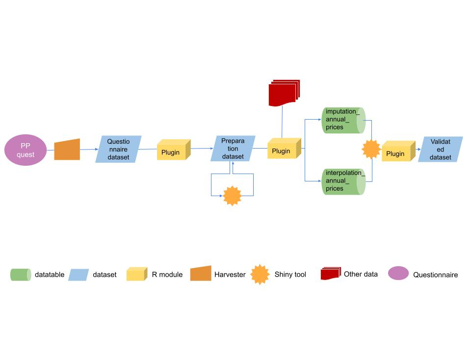

--- 
title: "Migration of Producer prices compilation into the SWS"
author: "Charlotte Taglioni (Statistician, ESSD - Methodological Innovation Team)"
date: "`r Sys.Date()`"
site: bookdown::bookdown_site
output: bookdown::gitbook
css: ess.css
documentclass: book
link-citations: yes
description: "This online book describes the migration of the statistical processes performed by the Economic team of the Statistical division (ESSD) into the Corporate Statistical Working System (SWS) for the imputation and validation of producer prices time series."
---

# **Introduction** {-}

The Economic team of the Statistical division (ESSD ECO team) is migrating its statistical processes into the Corporate Statistical Working System (SWS). This online book documents the significant steps that have been taken for this migration. The document describes the main institutional actors involved in the migration as well as the supporting objects (**code lists**, **datasets**, **data tables**) that have been created to support the SWS plugins (R modules) to meet technical unit requirements. Furthermore, the SWS plugins and Shiny applications are presented in the form of chapters providing a detailed description of their workflows as well as results.  

```{block , type= 'rmdnote'}
**IMPORTANT:**
Use the **Chrome browser** to have a correct visualization of HTML outputs in this online document.

```


## **Migration actors** {-}

Any migration into the SWS requires the interaction between at least three actors:

1. The **technical unit** interested in automating either some or all its analytic processes in the SWS. The technical unit can be treated as client demanding services from the counterparts responsible for the implementation of its data and statistical assets in the SWS. Therefore, a successful migration depends on the coordination between the technical division and other parts. In this migration framework the technical unit is the ECO team and is represented by:

- **Piero Conforti** *Senior Statistician and team leader, ESSD*
- **Jean Maire Munyeshyaka** *Statistician, ESSD*
- **Michele Vollaro** *Economist and statistician, ESSD*
- **Claudio Valeri** *Statistical clerk, ESSD*
 
2. The **ESS - Methodological Innovation Team** (ESS - SWS) responsible for the implementation and documentation of the required statistical processes. From the ESS - SWS team the focal points for FIAS - SWS process migration are:

- **Carola Fabi** *Senior Statistician and team leader (ESSD)*
- **Charlotte Taglioni** *Statistician (ESSD)*

3. The **CSI - SWS** the **primary backend and frontend maintainer of the SWS** and responsible for the implementation and documentation of non-statistical processes (IT infrastructure). The CIO - SWS team have as interlocutors:

- **John Rowell** *Information Technology Officer (CSI)*
- **Enrico Anello** *Full Stack Developer (CSI)*
- **Matteo Terrinoni** *Lead Front End developer (CSI)*


## **New methodology** {-}

This document aims to provide a detailed description of the new processes of collection, processing, analysis and dissemination of producer price data in FAOSTAT. The underlying objective is to provide both technical and practical material for in-house (ESS) orientation and training on the Producer Prices domain.
The book focuses on SWS statistical processes and on the new methodology prepared by Michele Vollaro that can be found along with the old one in the [shared folder](https://unfao.sharepoint.com/sites/tssws/Shared%20Documents/Forms/AllItems.aspx?viewid=07492829%2Dae8e%2D4338%2Dbc40%2D97411da985e8&id=%2Fsites%2Ftssws%2FShared%20Documents%2F03%2E%20Statistical%20Documentation%2F02%2E%20Statistical%20Processes%2F04%2E%20ESS%20%E2%80%93%20Agriculture%20Producer%20Prices%20and%20Price%20Indices) of the SWS.


## Producer prices (based on previous documents) and SWS introduction {-}


Information on producer prices is of great significance to policy makers and analysts. Relative prices are amongst the main determinants of the type and volume of agricultural production and reflect actual and future market conditions. Data on prices serve various uses including assessment of productivity and competitiveness of a commodity or sector and the evaluation of the contribution of various sectors to the economy and assessing food security. In this respect, producer price information is essential as it is used to value the production quantities recorded in FAOSTAT for the various commodities and countries.

FAOSTAT provides data on absolute producer prices for crop and livestock products to users through its Price domain.
Annual producer prices are available in local currency, standard local currency and US dollars. To date, prices are available from 1991 onwards whilst historical data from 1966 to 1990 are available in the Price Archive section of the Price domain of FAOSTAT in local currency only. Most data originate from country sources received through the FAO questionnaires. In some cases, data are supplemented with official country publications and institutional databases. In addition, where no official data are available, these are complemented by FAO estimates.

Producer price indices calculated on the basis of absolute prices are also disseminated on an annual basis, as well as monthly producer prices, whose collection started in 2012 and that are available in the Price domain of FAOSTAT from 2010 onwards in local currency only.

The producer prices refer to prices received by farmers, i.e. prices determined “at the farm gate” or at the first-point-of-sale when farmers participate in their capacity as sellers of their own products. While the aim is to remain as close as possible to this concept, flexibility has to be allowed to given the specificities of each country and commodity markets. Indeed, the choice of appropriate selling points may differ depending on the country and on the marketing structure for each commodity. For example, wholesale prices or even prices at local markets may be appropriate proxies of farm-gate prices when the marketing chain is very limited. On the other hand, in more intermediated markets in which transport and commercial margins constitute a significant share of the commodity price, it is necessary to remain as close as possible to the farm-gate concept.


A whole range of activities is undertaken by FAO’s Statistics Division before the price data is ready for dissemination to users. The different stages of this work are:

1. Data Collection
2. Data Entry
3. Data Processing and Analysis
4. Data Dissemination

Broadly, the process of price compilation begins with questionnaires being sent to FAO members requesting information on prices received by farmers and other supplementary information. The information received from countries is checked on a number of aspects like currency units and units of measurement to ascertain data consistency with past data. The data are then entered into the Statistical Working System (SWS), imputed if data not provided or found missing, and validated through a shiny application. Finally, the validated data are uploaded to the Price domain of FAOSTAT for dissemination to users.

The Statistical Working System (SWS) is currently the corporate tool to manage all stages of the workflow desribed above. 


### Producer prices: workflow {-}

Figure \@ref(fig:WFpp) represents the essential points of the overall workflow for processed production data.

```{r  WFpp, echo=FALSE, out.width="100%", fig.cap='General workflow.'}

```

The first part of the workflow is the questionnaire harvester followed by the currency conversion from Local Currency Unit (LCU) to Standard Local Currency (SLC) and US Dollar (USD); this step migrates data from the 'questionnaire' dataset to the 'preparation' dataset, where most of the operations will be performed.
As questionnaires contain 3 years a first control of consistency between the data previously saved in the dataset and the questionnaire ones is performed. If a substantial discrepancy is found the figure is reported in the datatable 'revisions2control'. The user can therefore check the modification and refuse them restoring the previous values if required.
After these preliminary steps, the outlier detection is performed on the last questionnaire year, i.e. the new year for which no data is yet available in the dataset. A manual intervention through the shiny application is required to validate the detected outliers and to proceed with the missing data imputation and validation. After the missing data imputation operation result is available the user can check and impute the mising figure according to the best method. Once all the missing values have been imputed the dataset is ready to be fully validated and disseminated.
All stages are described in the following paragraphs along with all the objects needed by routines to work properly.

All the SWS objects/resources used are listed below and need to be updated by the technical unit if needed.

## **SWS resources**  {-}

SWS resources are R modules, data tables, data sets, and code lists. 
Data tables are typically used as auxiliary data to help R modules to achieve their goals, often a long-format four-to-six dimensional data set. 
The statistical domains in SWS, through code/reference lists, define the dimensions of the datasets. Therefore, datasets are primarily used to store code list - referenced values as either input and output in the SWS. 


### Code lists {-}

Code lists, also called reference lists in SWS parlance, are the dimensions making up the data sets that are designed by the user to store analytic results from SWS modules. Some dimensions are statistical-domain-specific and are defined by the technical unit to reflect its needs regarding data collection, processing, and dissemination while meeting FAO standards. Each data set dimension has a set of codes and their associated descriptions. Thus, code lists serve to the purpose of standardization, visualization, and metadata by associating standardized codes to standardized names in the SWS data set outputs. A typical SWS compliant data set has, therefore, the following dimensions/reference lists:

Along with the new methodology, also the main standards and classifications used changed to be inline with the Agricultural production data also processed into the SWS. All the datasets and questionnaires are now always using the following classifications:

- Country code: Standard country or area codes for statistical use (M49), corresponding to the SWS codelist _geographicAreaM49_.

- Product code: Central Product Classification (CPC), corresponding to the SWS codelist _measuredItemCPC_


1. **Geographic area**. Representing the spatial scale the information is measured at. For example countries, territories, regional aggregates, regional special groups aggregates, global aggregates. In SWS, the geographic area dimension used is named **geographicAreaM49**. 
2. **Items**. These one want to take a measurement from. For example, commodities, commodity groups, land use types, species, etc. The ECO team, compliant with other important SWS domains, uses the item code/reference named: **measuredItemCPC**.

3. **Elements**. Often representing a measurement that can be taken across different items. For example, area, production, share. In SWS, the element dimension/code list used by ECO team dataset is named **measuredElement** and specifically the subgroup named _Output Price_.

4. **Time** (the time unit the data is displayed for: year, months, etc). In SWS, the time dimension used is named **timePointYears** and **timePointMonths**.

5. **Flag** (A standardized label indicating origin and/or nature of a number in the data set, e.g. <blank> (Official number)). In SWS, the flag dimension used is **flagObservationStatus**. Please check the [OCS statistical standards](http://intranet.fao.org/statistics_coordination_portal/standards_for_quality_compliance/) and the [flags document](http://intranet.fao.org/fileadmin/user_upload/scp/Standards_for_quality_compliance/SSS1_Flags.pdf) to understand the flagObservationStatus rational and  obtain the description of flags. 

6. **Method** (A standardized label indicating method utilized to obtain a number in the data set). In SWS, the method dimension used, combined with the observation flag, is named **flagMethod**. Please check the [OCS statistical standards](http://intranet.fao.org/statistics_coordination_portal/standards_for_quality_compliance/) and the [flags document](http://intranet.fao.org/fileadmin/user_upload/scp/Standards_for_quality_compliance/SSS1_Flags.pdf) to understand the flagMethod rational and  obtain the description of flags.


### Data tables {-}

Data tables are mainly used to store information helping R modules to output analytic results. Information in data tables can be of a number of types and, especially when they are used for mapping purposes, they have to be regularly checked and updated.


- **currency_changes** (SWS identifier: `currency_changes`) 

- **currency_country_years** (SWS identifier: `currency_country_years`) 

- **currency_dates** (SWS identifier: `currency_dates`) 

- **imputation_annual_prices** (SWS identifier: `imputation_annual_prices`) 

- **interpolation_annual_prices** (SWS identifier: `interpolation_annual_prices`) 

- **lcu_2_m49** (SWS identifier: `lcu_2_m49`) 

- **List of countries - Geary-Khamis** (SWS identifier: `country_list_for_gk`) 

- **List of inputs/outputs for GK** (SWS identifier: `input_output_item_gk`) 

- **List of items - Geary-Khamis** (SWS identifier: `item_list_for_gk`) 

- **Mapping table from Input System flag to SWS** (SWS identifier: `mapping_input_system_flag_2_sws`) 

- **method_flag_link** (SWS identifier: `method_flag_link`) 

- **outlier_detected** (SWS identifier: `outlier_detected`) 

- **pp_obsolete_codes_legacy** (SWS identifier: `pp_obsolete_codes_legacy`) 

- **pp_token** (SWS identifier: `pp_token`) 

- **Price Ratio (by country)** (SWS identifier: `pp_tcf`) 

- **revisions2control** (SWS identifier: `revisions2control`) 

- **toi_data** (SWS identifier: `toi_data`) 


### Datasets {-}


- **Annual Producer Prices (Legacy ARIMAX)** (SWS identifier: `annual_producer_prices_legacy_arimax`) 

- **Annual Producer Prices (Legacy)** (SWS identifier: `annual_producer_prices_legacy`) 

- **Annual Producer Prices (Preparation)** (SWS identifier: `annual_producer_prices_prep`) 

- **Annual Producer Prices (Questionnaire)** (SWS identifier: `annual_producer_prices_quest`) 

- **Annual Producer Prices (Validated)** (SWS identifier: `annual_producer_prices_validation`) 

- **Consumer Price Indices** (SWS identifier: `consumer_price_indices`)

- **International Dollar Prices** (SWS identifier: `international_dollar_prices`) 

- **Monthly Producer Prices (Legacy)** (SWS identifier: `monthly_producer_prices_legacy`) 

- **Monthly Producer Prices (Questionnaire)** (SWS identifier: `monthly_producer_prices_quest`) 

- **Monthly Producer Prices (Validated)** (SWS identifier: `monthly_producer_prices_prep`) 

- **Purchasing Power Parities** (SWS identifier: `purchasing_power_parities`) 

### Elements description {-}

The datasets of the Producer prices domain use three main codes for the different type of currency used:

- **Producer Price (LCU/tonne) [Lc]** (code: 5530)

- **Producer Price (SLC/tonne) [Slc]** (code: 5531)

- **Producer Price (USD/tonne) [US$]** (code: 5532)

In addition to these three main codes there are codes that pertain to derived prices and indexes:

- **Producer Price (Int \$/tonne) [Int.\$]** (code: 5533)

- **Average Producer Price (Int. \$/tonne) [Int.\$]** (code: 5540)

- **Producer Price Index (2014-2016 = 100)** (code: 55392)

- **Purchasing Power Parities** (code: 6149)


### Flag conversion {-}

Transitioning from the current system to the SWS also the flag system is being updated. The conversion has been performed according to the following table:

| **FLAG description** | **Current FIAS flag** | **FlagObservationStatus** | **FlagMethod**|
|:------|:----------|:---------|:---------|
| Historical estimates (Prices domain) | ‘Fz’ | ‘E’ | ‘f’ |
| FAO estimate | ‘F’ | ‘E’ | ‘f’ |
| Official data reported on FAO Questionnaires from countries | ‘Q’ | ‘’ | ‘q’ |
| Calculated data | ‘Fc’ | ‘I’ | ‘i’ |
| Manual Estimation | ‘Fm’ | ‘E’ | ‘f’ |
| Extrapolated/interpolated | 'Ft' | 'I' | 'e' |
| Estimated time series to complete the core data matrix | 'Fk' | 'E' | 'f' |
| Other analytical methods | 'Fa' | 'E' | 'f' |
| Calculated Prices data (using TCF on official data) | 'C' | 'E' | 'i' |
| Calculated Prices data (using TCF on estimated data) | 'Ce' | 'I' | 'i' |
| International Organizations | 'X' | 'X' | 'p' |
| Estimated data visible on external | 'K' | 'E' | 'f' |
| Data on country official publications or web sites or reported by Int. Orgs (source is the country) | 'W' | 'X' | 'p' |
| Official provisional data reported on FAO Questionnaires from countries | 'Qp' | 'P' | 'q' |
| Missing value | '-' | 'O' | 'q' |
| Provisional data reported on country official publications or web sites (Official) | 'Wp' | 'P' | 'p' |

Respectively the FlagObservationStatus and the FlagMethod are defined by the SDMX standard as:
-	FlagObservationStatus: for dissemination. Definition: Information on the quality of a value or an unusual or missing value. This item is normally coded and uses codes providing information about the status of a value, with respect to events such as "break", "estimated value", "forecast", "missing value", or "provisional value".
-	FlagMethod: this list of methods flags is to be used by IT specialists in statistical working systems only (Statistical Working System -SWS- and others). It does not concern dissemination. It relates to the method the figure comes from.
